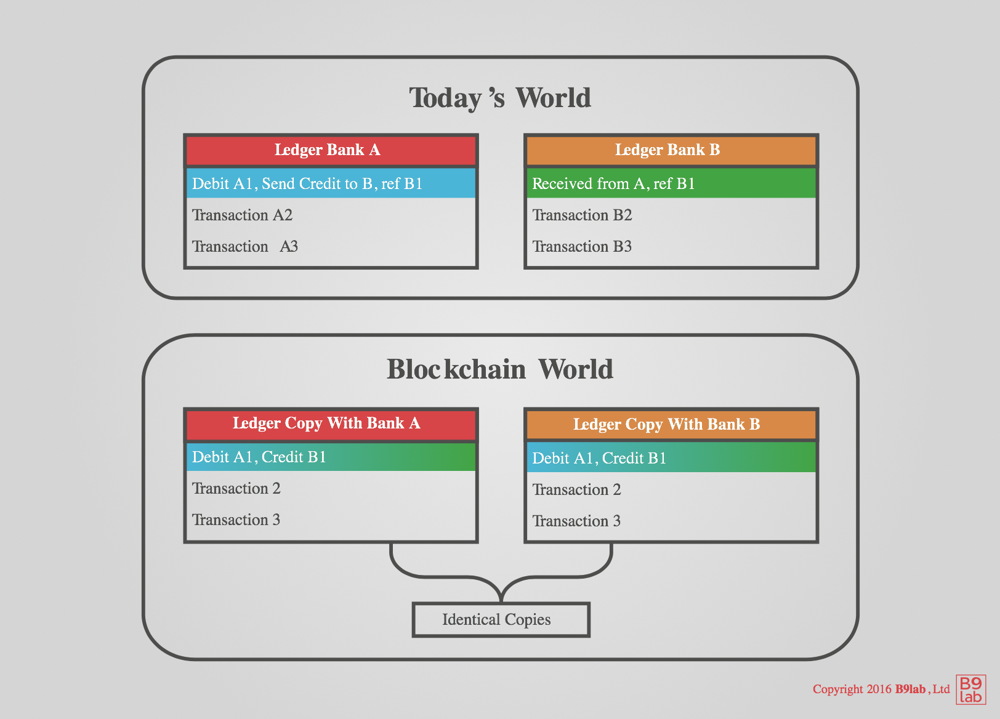
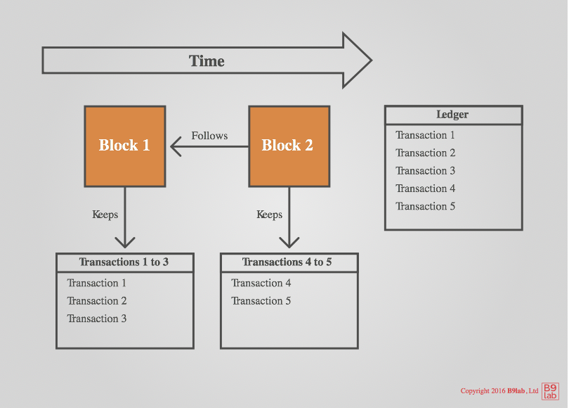
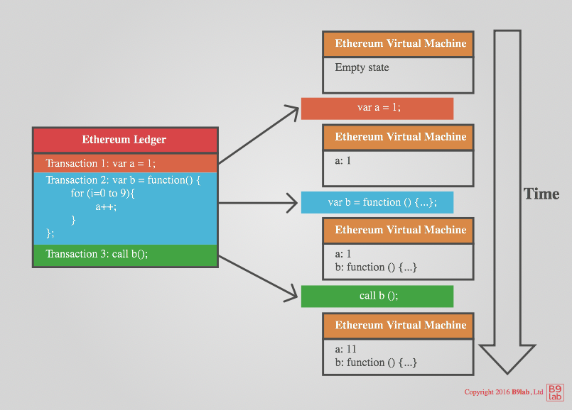
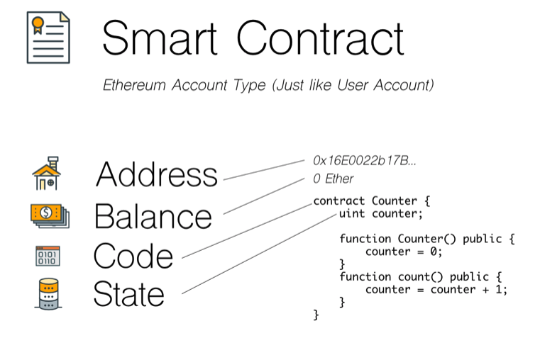

# Intro to Ethereum & Solidity 

The promise of a World Computer
---

### What the Blockchain??

+++

Roleplay: Real money transaction

+++

Roleplay: (Simulated) PayNow transaction

+++

Explanation: Distributed Ledger Technology

Note:

---

### Ethereum Parts

+++

Blockchain

+++

Ethereum Virtual Machine

+++

### Ether
- Ether     : A transferable unit of value
- Gas       : The cost of an opcode 
- Gas Price  : How many ethers per unit of gas

Note:
Opcode Costs
math, conditionals, jumps 0-10
creating contract 32000
blockchain variable storage 20000
transaction 21000
maximum block gas limit 6.7m

~ US$0.532 / 21000 gas 
+++

### Nodes
- Ethereum clients that connect to the network and store a copy of the blockchain
- All Miners are nodes, not all nodes are Miners
- Miners influence eventual consistency of the blockchain

+++

### Transaction

An atomic list of operations that act 

on the current state to return a new state

+++

### User Accounts
- have an address (e.g 0x6273060 ... a8BEf57)
- have a balance
- are the origins of transactions
- addresses are derived from private key

Note:
Addresses are 160 bits (40 hex chars)

+++

[Ref: Gjermund Bjaanes](http://www.gjermundbjaanes.com/understanding-ethereum-smart-contracts/)

Note:
Every instance of a smart contract is uniquely located at an address
Can call other smart contracts

---

### How to Interact?

 
[Ref: Mahest Murthy](https://medium.com/@mvmurthy/ethereum-for-web-developers-890be23d1d0c)

---
# Ok, Enough Words.

